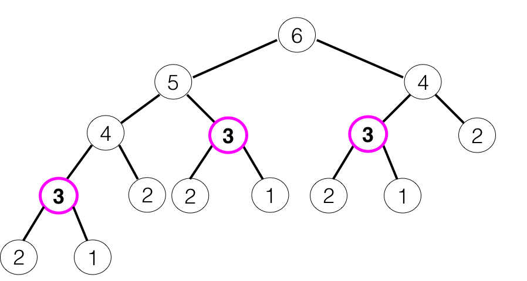

# Dynamic Programming

As we saw in the previous two readings, recursion can be a great tool to break apart problems into smaller chunks. However, this technique often comes with significant performance costs. Recall our `fibonacci` example:

```ruby
def fibonacci(n)
  return 1 if n == 1 || n == 2
  return fibonacci(n - 1) + fibonacci(n - 2)
end
```

This tiny, innocuous-looking function runs in O(2<sup>n</sup>) time. What does that mean in practice? Let's take a relatively small input, *n* = 100. Our exponential time complexity tells us that `fibonacci(100)` will take on the order of 2<sup>100</sup> = 1.26 x 10<sup>30</sup> units of time to run. Imagine that those units of time are extremely small, say a nanosecond (one billionth of a second). Even then, if our units are that small, `fibonacci(n)` will run on the order of 10<sup>13</sup> *years* to run. That's right, 10 trillion *years*. Don't wait around.

It would be nice to be able to use recursion without withering into old age and dying long before our program can finish executing. To figure out how we'll do this, let's have another look at the call tree from our reading on recursive time complexity. This time, take a look at how many times we're calling `fibonacci(3)`.  



We make 3 calls to `fibonacci(3)`. That seems like a lot of extra work. It'd be nicer (and faster) to *store* the value of `fibonacci(3)` once we know what it is, and then refer back to it later on. This simple idea, often called *memoization*, is the key to the technique we'll be learning today: dynamic programming.

Dynamic programming combines recursion with memoization to achieve faster runtimes while still utilizing the recursive relationships inherent in many computer science problems.

## Top-Down Dynamic Programming

There are two ways to approach dynamic programming: *top-down* and *bottom-up*. Here's a good way to remember the two:

- **Top down**: start at the top of the big call tree. Record answers as you get them.
- **Bottom up**: start at the bottom of the big call tree. Record all the answers you know you'll need and return the answer you want once you have it.

Let's use a top-down approach to optimize our recursive Fibonacci function. Recall our original Fibonacci logic:

1. If *n* = 1 or 2, return 1.
2. If *n* > 2, return `fibonacci(n - 1) + fibonacci(n - 2)`.

We want to alter our logic just slightly so that in addition to *finding* our solution in Case 2, we're also *recording* our solution.

1. If *n* = 1 or 2, return 1.
2. If *n* > 2:
    - Let `ans = fibonacci(n - 1) + fibonacci(n - 2)`.
    - Record *ans* in a cache.
    - Return *ans*.

We're pretty vague here -- what kind of data structure should we use for our cache? We know that we want fast access to our data, so we should go with a data structure that gives us constant lookup time. Both a hash and an array will do that for us. Although we could use an array in this case, a hash is better since it does not confine us to integer keys.

1. If *n* = 1 or 2, return 1.
2. If *n* > 2:
    - Let `ans = fibonacci(n - 1) + fibonacci(n - 2)`.
    - Record *ans* in `@cache`, a storage hash.
    - Return *ans*.

Almost there, but there's one thing missing: we haven't actually *optimized* anything yet! Remember, the optimization happens when we take advantage of all this stored data by returning early if our answer is stored in the cache. This check takes place in Case 1. Let's initialize `@cache = { 1 => 1, 2 => 1 }` so that our base case is still included in this check.

1. If `@cache[n]` is not `nil`, return it.
2. If *n* > 2:
    - Let `ans = fibonacci(n - 1) + fibonacci(n - 2)`.
    - Record *ans* in `@cache`, a storage hash.
    - Return *ans*.

That's it! Let's see how this changes our code when we incorporate these changes.

```ruby
def fibonacci(n)
  # return 1 if n == 1 || n == 2
  # Check our cache instead of the original base case
  return @cache[n] unless @cache[n].nil?

  # Record our answer in our cache before returning it
  ans = fibonacci(n - 1) + fibonacci(n - 2)
  @cache[n] = ans
  return ans
end
```

There's one thing missing here, and that's our initialization of `@cache`. There are several ways to keep track of the memoized information when you're using dynamic programming. The one you choose is up to you. We'll come back to this later on, but for now imagine that this method is sitting inside a class, and that the `@cache` is created upon initialization:

```ruby
class Fibonacci
  def initialize
    @cache = { 1 => 1, 2 => 1 }
  end

  def fibonacci(n)
    # return 1 if n == 1 || n == 2
    # Check our cache instead of the original base case
    return @cache[n] unless @cache[n].nil?

    # Record our answer in our cache before returning it
    ans = fibonacci(n - 1) + fibonacci(n - 2)
    @cache[n] = ans
    return ans
  end
end
```
And that's all there is to it! Before moving on, copy the code above into IRB and run `fibonacci(100)`. Does it finish in a few milliseconds? We'll discuss the time complexity improvements in detail later, but this simple test case should prove to you how powerful dynamic programming is.

### Bottom Up Dynamic Programming

Now let's look at the Fibonacci sequence another way. Imagine that you were asked to find `fibonacci(100)`. Since we know the recursive relationship of the Fibonacci sequence, our thought process might be something like this:

*fibonacci(100) depends on fibonacci(99) and fibonacci(98)...better find those.*

*fibonacci(99) depends on fibonacci(98) and fibonacci(97)...better find those.*

*fibonacci(98) depends on fibonacci(97) and fibonacci(96)...better find those.*

*... and so on ...*

Eventually, we'd come to our base cases, `fibonacci(1)` and `fibonacci(2)`. In the course of this process, however, we have named every piece of information that we need in order to produce `fibonacci(100)`: namely, we require `fibonacci(1)`, `fibonacci(2)`, `fibonacci(3)`, ... , `fibonacci(99)`. So why must we build this list starting at the top, with `fibonacci(99)`? Since we know what we need, how about we build it from the *bottom up*?

Bottom up dynamic programming does exactly that. We still use a `@cache`, but instead of writing `@cache` as we're trying to find `fibonacci(n)`, we'll build `@cache` *first* and then return the desired entry, `@cache[n]`. Let's see how this would work.

Typically, we use a helper function to build the cache, while our main function simply calls the helper and returns the correct entry. That's what we'll do here.

```ruby
def fib_cache_builder(n)
  # Builds the cache, starting at 1 and ending at n
end

def fibonacci(n)
  # Calls the helper function
  # Returns the nth entry
end
```
Let's build the helper function. This starts from the bottom and builds up a cache of Fibonacci numbers as it goes. Notice how similar the helper function is to an iterative approach to this problem.

```ruby
def fib_cache_builder(n)
  # Builds the cache, starting at 1 and ending at n
  cache = { 1 => 1, 2 => 1 }
  return cache if n < 3
  (3..n).each do |i|
    cache[i] = cache[i - 1] + cache[i - 2]
  end

  cache
end

def fibonacci(n)
  # Calls the helper function
  # Returns the nth entry
end
```

Finally, let's build out the function itself, completing our bottom-up approach.

```ruby
def fib_cache_builder(n)
  # Builds the cache, starting at 1 and ending at n
  cache = { 1 => 1, 2 => 1 }
  return cache if n < 3
  (3..n).each do |i|
    cache[i] = cache[i - 1] + cache[i - 2]
  end

  cache
end

def fibonacci(n)
  # Calls the helper function
  cache = fib_cache_builder(n)
  # Returns the nth entry
  cache[n]
end
```
Notice that `fib_cache_builder` runs in `O(n)` time: after assigning the base cases, it iterates through the integers 3 to *n* and performs the constant time operations of hash lookup, addition, and hash assignment on each iteration. Hence, just like the top-down approach, this bottom-up approach also reduces our time complexity from exponential to linear time.

That covers the basics of dynamic programming, but the fun hasn't even begun yet! It's time to move on to the project, which will introduce you to a variety of different dynamic programming examples and talk through the approach of each.

[Start the project!](./dynamic_programming_2.md)
