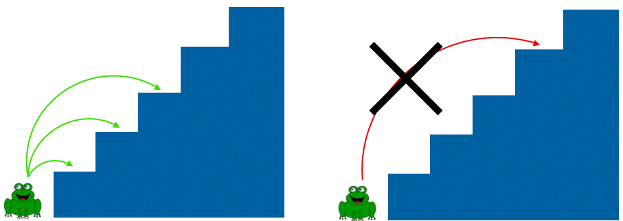
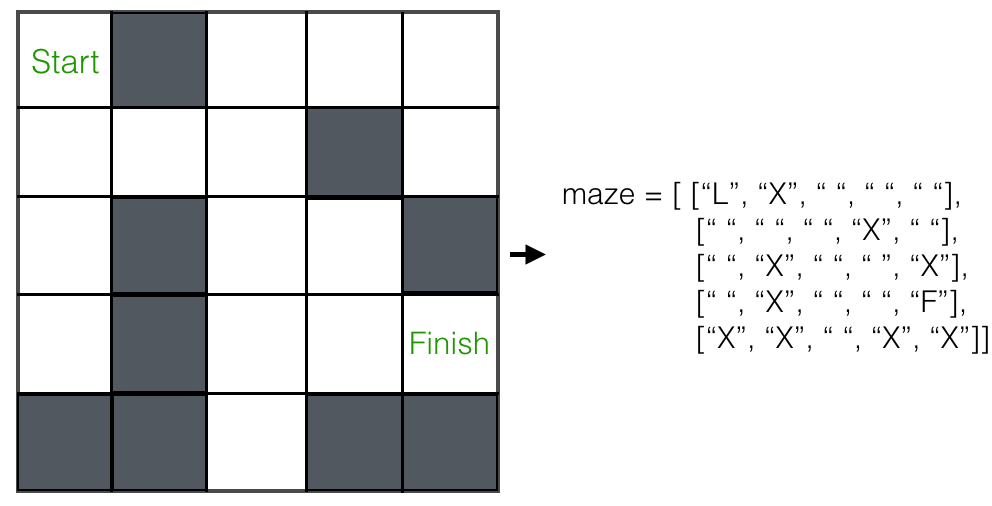
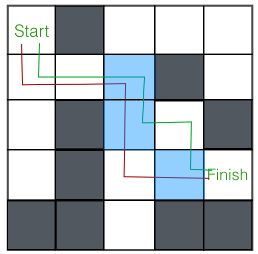

# Dynamic Programming: Project

It's time to practice what we've learned. This project will be part reading, part programming. As we build up your knowledge, you'll take a more active role in *designing* as well as implementing these algorithms. Let's get started!

### Setup

Dynamic programming problems often involve maintaining some sort of a cache (usually using a hash or an array) for storing solutions to smaller subproblems that have already been seen. Each run of the function must refer to the same cache object -- otherwise, there's danger that two calls with the same input give a different output.

There are several ways to deal with this rather annoying problem. We could use globally scoped variables (depending on our language of choice). We could also pass a pointer to the cache from call to call -- this is called *passing by reference*, and it's an important concept in software development. Once again, whether passing a reference will work or not depends upon the language. In Javascript, for example, all non-primitive types are passed by reference, so we could pass a hash or an array in this way. In Ruby, everything, including something like a hash or an array, is *passed by value*, meaning that when a parameter is passed into a function, that function makes a copy of of the parameter and then refers to and mutates that copy.

The solutions outlined above both work, but to keep our code readable and our work organized, we'll use a class in Ruby. Within that class, we'll create instance variables to use as our caches -- one for each of the dynamic programming problems we attack. Go ahead and start by doing that:

```ruby
class DynamicProgramming
  def initialize
  end
end
```
We should note as well that we'll only use this technique for *top-down* implementations. For bottom-up implementations, a helper function will build out and return the cache, so that we don't have to worry about updating it while we're performing recursive calls.

Side note: if you were going to use dynamic programming in a real-world context, you probably wouldn't want to do it this way. However, it's very likely that you'd be working within a class, functional scope, or other context that would allow you to create and maintain your cache in some reasonable way.

**NB**: if you're whiteboarding a dynamic programming question, you probably don't need to bother creating a class. Just initialize a cache object outside the function and refer to it. However, make sure the interviewer knows what you're doing! Explain to them that you're assuming that the cache is globally scoped, and even clue them into how you would approach the actual implementation of it.

### Warmup

Now that we've dealt with the annoying cache problem, let's start with a problem similar to Fibonacci. We'll define the *Blair numbers* as follows:

- The first Blair number, <i>b<sub>1</sub></i>, is 1,
- The second Blair number, <i>b<sub>2</sub></i>, is 2,
- The <i>k</i>th Blair number is the sum of the previous two Blair numbers plus the *k* - 1st odd number. For example, <i>b<sub>3</sub></i> = <i>b<sub>2</sub></i> + <i>b<sub>1</sub></i> + 2nd odd = 1 + 2 + 3 = 6.

Your job in this warmup is to write `blair_nums(n)`, which should return the *nth* Blair number. First, write this function recursively. Here's an outline of the code to get you started:

```ruby
class DynamicProgramming
  ...

  def blair_nums(n)
    # Base case(s): which inputs n should return early?
    # Recursive case: what's the recursive relationship?
    # *NB*: you'll need to figure out how to express the nth odd number in terms of n.
  end

  ...
end
```
Try running `blair_nums(100)`. Assuming you haven't yet done any optimization, it's probably pretty slow. Is it done yet? Probably not. How about now? Not yet! Let's introduce a cache as we did with the Fibonacci numbers to optimize the runtime. Start by adding an instance variable to our `initialize` function.

```ruby
def initialize
  @blair_cache = {}
end
```
But wait! We have some information about the Blair numbers that we didn't include in the cache: those two base cases, <i>b<sub>1</sub></i> and <i>b<sub>2</sub></i>. Add those to the cache as well.

Now it's time to optimize `blair_nums`. Remember, we want to *check the cache first* and return early if we find our answer is already stored. We also want to add any new answers that we find to `@blair_cache` before returning.

```ruby
def blair_nums(n)
  # Check the cache for a stored answer
  # If not found, 1) perform the recursion, 2) store the answer, 3) return the answer.  
end
```

Now try running `blair_nums(100)` again. If you've done it right, it should finish running by the time you finish reading this sentence! What was the time complexity of the original, unoptimized `blair_nums`? What's the time complexity of the optimized function?

You've just written `blair_nums` using top-down dynamic programming. Can you write `blair_nums` using bottom-up dynamic programming? Remember, *bottom-up* means that you're going to create the *entire* cache first, then return the appropriate (usually the last) entry. Use the bottom-up implementation of `fibonacci(n)` as a guide.

### Frogs Hopping

A frog is sitting at the bottom of a staircase with *n* stairs. Tiny little frog can only jump so many steps at once. In particular, it can only hop 1, 2, or 3 steps at a time.



Given this information, write a function to return the number of ways the frog can get to the top of the stairs. For example, if there are two stairs in the staircase, there are two ways for the frog to get to the top: hop 2 steps, or hop 1 step and then hop 1 step again. For *n* = 3, there are 4 ways: [1, 1, 1], [1, 2], [2, 1], and [3].

First, let's practice our bottom-up skills. Let <i>s</i><sub>n</sub> be the number of ways the frog can hop to the top of *n* stairs. The first step is to define the recursive relationship between the answer we want, <i>s</i><sub>n</sub>, and previous answers for smaller staircases. The key observation here is that the frog has 3 choices for its first hop: it can hop 1 stair, 2 stairs, or 3 stairs. This means that:

<i>s</i><sub>n</sub> = <i>s</i><sub>n - 1</sub> + <i>s</i><sub>n - 2</sub> + <i>s</i><sub>n - 3</sub>

Careful, though! This relationship only holds true if *n* is large enough. What happens when *n* is below a certain threshold? What is that threshold?

The equation above tells us something important: we can build the *ith* solution using only the *i* - 1st, *i* - 2nd, and *i* - 3rd solutions. This is what we will do, until we have built enough previous solutions to get the *n*-th solution. Start by defining two functions in your `DynamicProgramming` class:

```ruby
def frog_hops_bottom_up(n)
end

def frog_cache_builder(n)
end
```
Remember that when we use a bottom-up approach, we don't need to define an instance variable in `initialize`. You will do this for the top-down approach, however.

Let's build out `frog_cache_builder`. Start from the bottom: create a cache (a hash or an array will work here). Add the solutions for the three base cases to this cache. Make sure to add a check to see if *n* falls into one of these cases before building out the rest of the function.

```ruby
def frog_cache_builder(n)
  # Make a hash or array for storing previous solutions
  # Add the base cases to the cache
end
```
Next, build up the solutions in the cache. Start with 4 and go all the way up to *n*, using the recursive relationship we found previously. Finally, return the cache.

```ruby
def frog_cache_builder(n)
  # Make a hash or array for storing previous solutions
  # Add the base cases to the cache  
  # Build solutions 4..n into the cache
  # Return the cache
end
```
Now, it's time to build `frog_hops_bottom_up`. This one is easy: build the cache that you need using `frog_cache_builder`, and return the correct entry from that cache. What's the time complexity of `frog_hops(n)`?

**Next, build a top-down implementation of the same function.** As we did with the Blair numbers, write it recursively first, then introduce a cache that gets checked and updated upon finding new solutions.

### Super-Charged Frogs

Let's generalize the frog problem. This time, frogs have different jumping capacities. Some frogs can hop up to 10, 20, or 100 times at once, some only 3 or 4 times. The maximum number of jumps a frog can do will be passed in as a parameter, `max_stairs`, to the function you'll write.

Write a function, `super_frog_hops(num_stairs, max_stairs)` that takes in the number of stairs and the maximum number of stairs that can be hopped at once, and returns the number of ways this frog can make its journey.

First, we need to figure out the recursive relationships within this problem. This time, you'll have a heavier hand in designing the algorithm. Here's a list of questions that you should ask yourself as a guide.

1. What are the base case(s)? (Hint: you may be tempted to include *more* base cases than before, but it might make more sense to go *smaller* -- reduce the number of base cases used in `frog_hops`.)
2. What previous solutions do you need in order to find `super_frog_hops(num_stairs, max_stairs)`?
3. What happens when `max_stairs > num_stairs`? It might make sense to separate this case from the case where `max_stairs <= num_stairs`.

If you find yourself getting stuck, try looking at some reasonably-sized examples. Try `max_stairs = 4` at first.

Once you've defined the recursive relationships here, decide how to optimize. Choose either top-down or bottom-up implementation. What should you store in the cache? What answer should be returned? Create the necessary helper function or instance variable to suit your needs.

### Knapsack

Knapsack Problem: write a function that takes in an array of weights, an array of values, and a weight capacity and returns the maximum value possible given the weight constraint.  For example: if weights = [1, 2, 3], values = [10, 4, 8], and capacity = 3, your function should return 10 + 4 = 14, as the best possible set of items to include are items 0 and 1, whose values are 10 and 4 respectively.  Duplicates are not allowed -- that is, you can only include a particular item once.

Try this with a bottom-up approach.

One way you can do this problem is by creating a table of solutions. The bottom-up approach would suggest that we should solve knapsacks of increasing size and base each next size up on the solutions from smaller bags. The shape of your table might be one array for each increasing capacity size. With each array, you could have a best value entry for each item consideration; either you will add the value of the current item to the solution of a smaller bag, or you will use the most recent solution from this iteration of bag size.

We will be zero-indexing.

For example, if our weights are `[2,3,4]`, and our values are `[1,3,3]`, with a capacity of `7`, then our solutions table would look like: `[[0, 0, 0], [0, 0, 0], [1, 1, 1], [1, 3, 3], [1, 3, 3], [1, 4, 4], [1, 4, 4], [1, 4, 6]]`.
* Notice that for capacity `1`, none of our items fit, so the max value entry is all zeroes.
* Notice that for capacity `2`, the best value for each 'item consideration' is progressively copied forward from `table[2][0]` because only the item of weight `2` will fit.
* Notice in the entry for capacity `3`, that the entry for item `2` is similarly copied forward from item `1` (one item of weight 3 and value 3 will fit).
* Notice that for capacity `5`, item `1` adds its own value to the best solution from a smaller bag (capacity `2`, item `0`)
* Notice that for capacity `7`, item `2` adds its own value to the best solution from a smaller bag (capacity `3`, item `1`)

So, for each item consideration, you must select the optimum from between these two paradigms: use either the previous item solution at this capacity, or the previous item solution from a smaller bag plus this item's value.

The final solution is when we have considered all possibilities, having always selected the best one along the way. Therefore our solution is the last spot of the last array.

Having outlined the logical approach, now code it!

## Bonus
### Maze Solver

You're given a maze and asked to find a path from its starting location to the finish. The maze is 2-dimensional, and will be represented by an array of characters. Empty squares are represented with `" "`, blocked spaces with `"X"`, your location with `"L"`, and the finish with `"F"`.  Here's an example:



Write a function that takes in the maze array, starting position, and ending position, and returns an array of moves from start to finish. One possible return value for the example above is [[0, 0], [1, 0], [1, 1], [1, 2], [2, 2], [3, 2], [3, 3], [3, 4]]. There are a few other valid paths as well -- any one of them is a satisfactory return value.

This may not seem as straightforward an application of recursion as the previous examples. True! But there is a recursive structure here. Take note of a couple things:

1. Whatever position we find ourselves at in the maze, we have up to 4 choices for our next move: up, down, left, or right. Some of these may be blocked or out of bounds, however.
2. There's a base case here. What is it? Hint: for which position(s) in the maze do we already know the shortest possible path?

This gives us a pretty clear outline for our recursive algorithm. We'll check for our base case and return early if we find it. Otherwise, we'll run our algorithm on all the legal next moves and choose the one that returns the shortest path.

Conceptually, this makes sense. How do we implement it? Let's outline a purely recursive function before introducing any optimizations. Start with the base case. If you're at "F", you should return an array with just the coordinates of the "F" square.

```ruby
def maze_solver(maze)
  # Implement the base case here
end
```
Next, write the recursive case. Check all valid moves and choose the one that gives you the shortest path to the finish. Remember to add your current position's coordinates to the path!  

Try your function out on the example maze we gave above. Do you get the expected output? If so, you're ready to optimize!

What's the time complexity of `maze_solver`? Think about a relatively simple case: an `n x n` maze with no obstacles (i.e., all " " characters). About how many choices will we have for each move that we make? Make a rough sketch of a decision tree to help you visualize how many calls are being made. Come up with at least a good lower bound on the time complexity.

Now let's improve that time complexity by using dynamic programming. Let's think about what information we need to cache. Throughout the course of our recursion, we'll encounter the same square over and over again. For example, look at our example maze and two paths that we'll end up trying:



One approach would be to store the entire shortest path from each position to the end point in a hash. However, this would take up an enormous amount of space. Instead, for each position in the maze, let's only store the *next move* in its optimized path.

Take a top-down approach for this one. Create the instance variable that you need, `@maze_cache`, initializing it to an empty array or hash. An 2-dimensional array the same size as the maze is a straightforward choice in this case -- you'll be able to refer more easily to a given coordinate in the maze. Now, since you won't get the actual maze until the `maze_solver` function is run, you won't be able to populate any base cases to your `@maze_cache` on initialization of the `DynamicProgramming` object. That's okay, though. Set it up with this work-around:

```ruby
class DynamicProgramming
  def initialize
    @maze_cache = []
  end

  def maze_solver(maze, start_pos, finish_pos)
    # Call populate_maze_cache to set up the maze cache
    # Call and return or parse the result of solve_maze
  end

  private
  def populate_maze_cache(maze)
    # Create a maze_cache of the correct size
    # Record base case(s) in the cache
  end

  def solve_maze(maze, start_pos, finish_pos)
    # Do the actual work of solving the maze
  end
end
```
This is all the setup you need! Now, put your dynamic programming skills to work -- check the cache and record new results in the cache as you go. Try running your new code on the example maze. Does it still work? Also try running your code on the big example we gave. It should return in a few seconds this time!

How would you approach this problem using a bottom-up implementation? Hint: you may want to record *previous* steps to a solution instead of *next* steps.

## DOUBLE Bonus

Make a visual interface for `maze_solver` using Javascript. Having a visualization for a technically complex problem is a great way to appeal to folks like recruiters, who might not have a good sense for the coding side of things. Plus, it's fun and pretty!

## Next Steps

Dynamic Programming problems are a hallmark of tough technical interviews! Tackling all four implementations of Make Change as outlined in the reading would be a good start. Frog Hop, Knapsack, Maze Solver, and Sudoku are other common problems. There are also a lot of more 'mathy' ones, like finding the Longest Increasing Sub-sequence. Practice as many DP problems as you can!
