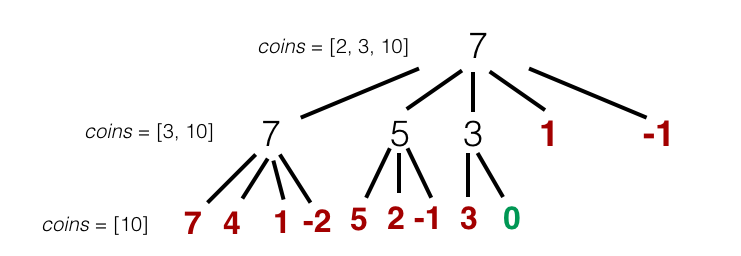

# Recursion: Not for the Faint of Heart

One of the trickiest concepts in programming to get your mind around is recursion. In computer science, *recursion* simply refers to the act of calling a function within itself. More generally, we say that a relationship, a function, a sequence, or anything else is *recursively defined* if successive entries or outputs rely on previous entries/outputs.  This seems like a simple concept, but it gets complicated fast. This reading will focus on taking the basic examples of recursion that we've already seen, and generalizing them to more sophisticated problems.

### A Simple Example: Fibonacci Numbers

You're familiar with the Fibonacci numbers: the first two numbers in the sequence are 1 and 1, and every other number in the sequence is obtained by adding together the previous two. The first few entries in the sequences are 1, 1, 2, 3, 5, 8, 13, 21....  This sequence will serve as a simple example of how to write a recursively defined function. The Fibonacci numbers themselves are defined recursively: let <i>f</i><sub>n</sub> represent the <i>n</i>th Fibonacci number. Assuming *n* > 2, we can find <i>f</i><sub>n</sub> by adding <i>f</i><sub>n - 1</sub> + <i>f</i><sub>n - 2</sub>, so the *n* th term of this sequence depends on the sequence's previous entries.

Suppose now that we wish to transform this recursively defined relationship into a *recursive function*. Namely, we want to write a function that prints out the <i>n</i>th Fibonacci number. Whenever we write a recursive function, must do two things:

- Identify the **base case(s)**
- Identify the **recursive relationship**

Our function will end up something like this:

```ruby
def fibonacci(n)
  # Check if we're in a base case
  # If we are, return the known answer
  # Else, carry out the recursion
end
```

Think of a recursive relationship like a chain of events that you're trying to follow back to its origins:

Scott: "What happened on Wednesday?"

Laura: "In order to know what happened Wednesday, you must know what happened on Tuesday."

Scott: "Ok, what happened Tuesday?"

Laura: "In order to know what happened Tuesday, you must know what happened on Monday."

Scott: "Ok, what happened Monday?"

Laura: "Jesse quit."

This is contrived, obviously, but it's exactly what we're doing with the Fibonacci numbers as well.

Scott: "What's <i>f</i><sub>8</sub>?"

Laura: "First you must find <i>f</i><sub>7</sub> and <i>f</i><sub>6</sub>."

Scott: "Ok, what are <i>f</i><sub>7</sub> and <i>f</i><sub>6</sub>?"

Laura: "First you must find..." <i>and so on...</i>

It's like a backwards chain. The base cases are the points at which our backwards chain terminates. Without a base case, we'd continue following the chain backwards ad infinitum. A recursive relationship is useless without base cases, so they are vitally important.

What are the base cases for our Fibonacci function? Since we want to produce the <i>n</i>th Fibonacci number and the 1st and 2nd are known to be 1, our base cases are `n = 1` and `n = 2`. Both should return 1.

```ruby
def fibonacci(n)
  # Check if we're in a base case
  # If we are, return the known answer
  return 1 if n == 1 || n == 2

  # Else, carry out the recursion
end
```

Next comes our recursive logic. We know that mathematically, <i>f</i><sub>n</sub> = <i>f</i><sub>n - 1</sub> + <i>f</i><sub>n - 2</sub> if *n* > 2. So, we make calls to `fibonacci(n - 1)` and `fibonacci(n - 2)` and add them together.

```ruby
def fibonacci(n)
  # Check if we're in a base case
  # If we are, return the known answer
  return 1 if n == 1 || n == 2

  # Else, carry out the recursion
  return fibonacci(n - 1) + fibonacci(n - 2)
end
```
This is the basis of all recursion: identify the base case(s) and the recursive relationship, and translate both into code.

**NB**: it's tempting to start writing code *before* you fully understand the recursive relationship, especially when you're just learning recursion.  **Don't do this!** You will save yourself many tears and headaches by sketching or pseudocoding the *relationship* first, then coding.

### A Harder Example: Making Change

Suppose that you have a set of "legal" coins and an amount of change you need to make with those coins. This is the setup for a few variations of a classic recursive interview problem. Some things you might be asked to do, given this setup:

- Return the minimum amount of coins needed to make correct change
- Determine whether it is possible to make change for a given set of coins and an amount
- Return all possible sets of coins that make correct change for the amount
- Return the *best* possible set of coins that make correct change for a given amount ("best" usually means the minimum number of coins)

We'll walk through the last variation of this problem. We'll write a function that takes in a set of coins and an amount, and returns the set of coins that makes change for that amount using the minimum number of coins.  For example, if `coins = [2, 5, 7]` and `amt = 12`, we'd return `[5, 7]`. If `amt = 16`, we'd return `[2, 7, 7]`. Repeats of coins are allowed.

Just as with every recursive problem, we begin by identifying the base cases. These are situations in which we already know the answer based on the inputs; we're already at the first link in the chain. Here, we have *two* inputs, and our base cases will involve both of them:

1. If `amt = 0`, then no coins are needed. Return `[]`.
2. If `coins` is an empty array, it is not possible to make change since we have no coins to choose from. Return `nil`.
3. If `amt` is less than the smallest coin in `coins`, then it is not possible to make change for `amt` with `coins`. Return `nil`.

It's important to note here that this *is not the only set of base cases that will work*. For instance, what happens when `amt < 0`? We should probably return `nil` in this case. However, using base case (3) will nullify the `amt < 0` case -- we'll see why as we write our function. There are other base cases here that we've left out, because these three are enough. What are some others that you can think of?

Next, we need to figure out what the recursive relationship is here. Let's use a new example set of coins, `[2, 3, 10]`. Given an `amt`, we may ask ourselves, *should we use the 2 coin or not?*.  This is a good question to be asking, because it gives us a choice: 2 or no 2. It also reduces the size of our input, potentially: if we use the 2 coin, we'll reduce `amt` by 2.

However, this isn't quite the right question to be asking, and here's why. Imagine that `amt = 7`. We want to return `[2, 2, 3]`, but if we constrain ourselves to choosing just "yes 2" or "no 2", we'll end up missing this solution (or repeating it in a different order, such as `[2, 3, 2]`, which is also undesirable). Instead, we should be asking *how many* 2's we should use. Since we're bounded by the `amt` that is passed in, so we'll still have a finite number of choices here. Think of this as a decision tree:



It's easy to see that `amt` will reduce by 2 x *number of* `2` *coins used*. However, we must also remove the 2 from the array of coins that we pass in -- essentially, we will scroll through all the possible ways of including the 2 coin and evaluate which of those gives us the optimal answer. Note that the recursive calls that take in `[3, 10]` and `[10]` are doing the same thing. Those calls are on the 2nd and 3rd levels of our tree, respectively.

Now it's time to translate the base cases and the recursive relationship into code. Let's start with the base cases. We will assume for ease of implementation that `coins` is a sorted array.

``` ruby
def make_change(amt, coins)
  # Check to see if we're in a base case

  # Is the amount 0?
  return [] if amt == 0
  # Is the coin array empty?
  return nil if coins.empty?
  # Is the amount less than the smallest coin?
  return nil if amt < coins.first

  # Carry out the recursive logic
end
```

Next, we need to write the recursive logic. Much like finding the minimum or maximum in an unsorted array, we'll look at all the possible ways of including the smallest coin, and choose the best one.

``` ruby
def make_change(amt, coins)
  # Check to see if we're in a base case
  return [] if amt == 0
  return nil if coins.empty?
  return nil if amt < coins.first

  # Carry out the recursive logic
  # Keep track of how many copies of our first coin we're using
  first_coin_copies = coins.first

  # Declare the initiial solution length to be infinity (for ease of comparison)
  solution = nil
  solution_length = 1.0/0.0

  # Add copies of the first coin until we exceed the amt passed in
  until first_coin_copies > amt
     # Make a recursive call using this number of copies of the first coin, and the coins array less the first coin
     candidate_soln = make_change(amt - first_coin_copies, coins[1...coins.length])

     # Check if the candidate we've just found is better than the saved solution
     if candidate_soln.length < solution_length
       solution = candidate_soln
       solution_length = candidate_soln.length
     end

     first_coin_copies += coins.first
   end

   solution
end
```
This is not the only solution to `make_change`. Much of our recursive logic depends implicitly on how we've defined our base cases. We noted earlier, for instance, that we didn't need to include the base case in which `amt < 0`. What in our recursive logic *prevents* us from having to make that check? How would your recursive logic change if you did include this base case? (Note: this is different from including a check that `amt >= 0` for error-checking purposes.  We may still want to do that regardless of our approach.)

### When Is Recursion Appropriate?

This is a tricky question to answer, because it's possible to *never* use recursion: anything that can be done recursively can also be done iteratively. Recall that by using recursion, we are working our way *down* a chain to a known case. We could, instead, work our way *up* that same chain until we get to the case that we want -- this option is, in essence, an *iterative* approach to the same problem.  We'll see more of this when we talk about dynamic programming.  

That being said, there are some problems where a recursive approach is the better option. The `make_change` problem we just walked through is a good example. Some telltale signs that recursion might be a good approach are:

1. **Working backwards seems natural**. When we first started thinking about `make_change`, it made a lot of sense to try to find the solution for a smaller amount and use it to get our answer. This is an earmark of a recursive problem: even if you can't visualize the whole thing, it's clear that there's a chain or a decision tree that you should follow.
2. **The problem can be broken into smaller subproblems of the same type.** In some ways this is a restatement of 1), but this concept can show up in different ways, too. Think of `merge_sort`. This recursive sorting algorithm works by breaking the array into two halves, then performing `merge_sort` on both halves of the array -- in essence, we're solving the same problem of sorting an array, we're just doing it on smaller chunks.
3. **Similar problems can be solved with recursion**. This is a tricky one, because sometimes a simple change in the statement of a problem can drastically change how you might approach it. But nonetheless, you may want to think about recursion if you've used (or seen others use) recursion on similar problems. One example is binary search, a recursively defined algorithm. Many interview questions require you to create a *modified* binary search, usually on a mostly-sorted data set of some kind. This modified algorithm will likely be recursive, just like the original is.

### Next Steps

Now that we've got recursion in our tool belt, we have a couple more topics to discuss! First, we'll spend some time talking about how to evaluate the time complexity of recursive algorithms. Then, we'll talk about how to drastically improve that time complexity with *dynamic programming*.

Next: Read about [Recursive Time Complexity](./recursive_time_complexity.md)
