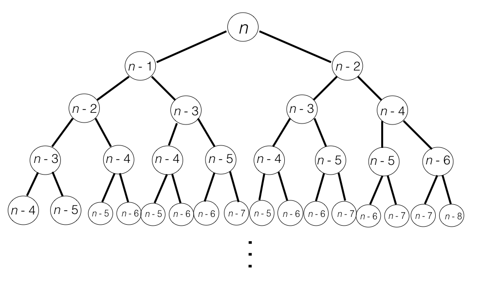
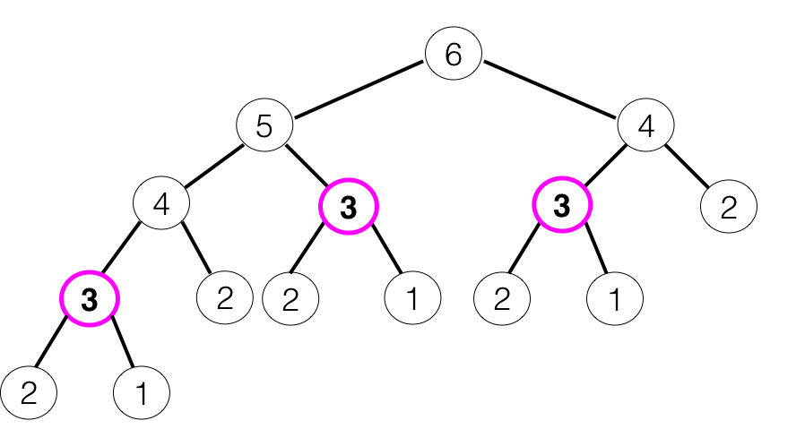
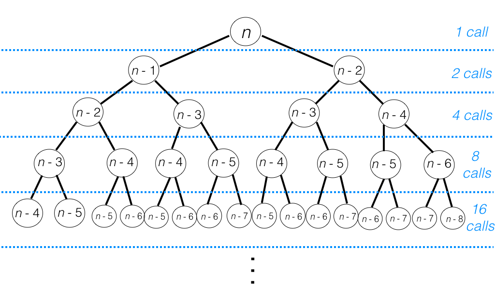
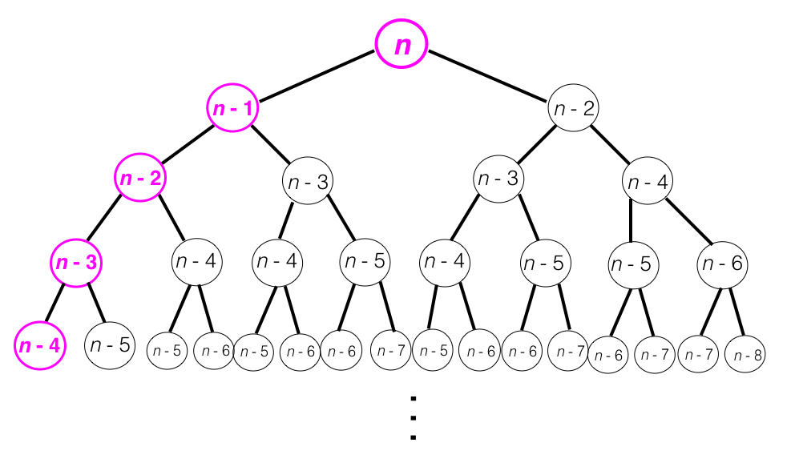

# Recursive Time Complexity

When it comes to evaluating time complexity, how well do recursive functions do? More fundamentally, how do we calculate the time complexity of a recursive function? With a nonrecursive function, we can look at every line of code, add together the time complexities of each line, and simplify:

```ruby
# Time complexity is O(1) + O(n) + O(n^2) = O(n^2)
def not_recursive(arr)
  # Assignment, addition are O(1)
  a = 1
  b = 2
  c = a + b

  # Iterating through arr is O(n) where n is the size of arr
  arr.each do |el|
    puts el
  end

  # Bubble sorting arr is O(n^2) where n is the size of arr
  sorted = bubble_sort(arr)
end
```
But how do we do this with a recursive function? We start by doing the same thing we did before: analyze line by line.

```ruby
def fibonacci(n)
  # Integer, boolean comparisons are O(1)
  return 1 if n == 1 || n == 2

  # Addition is O(1)...but what about these recursive calls?
  return fibonacci(n - 1) + fibonacci(n - 2)
end
```
We know from our previous work with big O analysis that we need to be careful of function calls within our function, and these recursive calls are no exception. But how do we do this? It seems like so much is happening at once, and it's *all* in the `fibonacci` function! Let's think instead about what happens at runtime. Remember that we're working within a single *thread* of Ruby, meaning that only one piece of code is executing at once. So those last two calls, `fibonacci(n - 1)` and `fibonacci(n - 2)` happen one after the other, not concurrently.

```ruby
# Make the function call:
fibonacci(100)
```
```ruby
# Runtime:
# Call fibonacci(100)
# Evaluate 100 == 1 || 100 == 2
# Call fibonacci(99) (from n = 100)
# Evaluate 99 == 1 || 99 == 2
# Call fibonacci(98) (from n = 100)
# Evaluate 98 == 1 || 98 == 2
# Call fibonacci(98) (from n = 99)
# Evaluate 98 == 1 || 98 == 2
# Call fibonacci(97) (from n = 99)
# Evaluate 97 == 1 || 97 == 2
# Call fibonacci(97) (from n = 98)
# Evaluate 97 == 1 || 97 == 2
# ...
```
There are a couple things to notice here: first, each *individual* call to `fibonacci` is executing in constant time. Second, it's not clear (yet) *how many* calls are being made to `fibonacci`, and we need to know that before we can evaluate the time complexity. This is the key to big O analysis with recursive functions.

**Evaluating Recursive Time Complexity (Attempt #1)**
1. Evaluate the time complexity of a single call to the function (ignoring recursive calls within it),
2. Find the number of times the function is called.
3. Use this info to find the time complexity of the recursive function.

Step 3 is pretty vague -- *how* do we use Steps 1 and 2 to perform 3? Let's imagine that we know how many recursive calls to `fibonacci` will be made when `fibonacci(n)` runs. Since each individual call runs in constant time, we have:

O(fibonacci(n)) = O(1) + O(1) + O(1) + ... + O(1) *<--- number of calls*
=> O(fibonacci(n)) = *number of calls* x O(1)
=> O(fibonacci(n)) = O(*number of calls*)

It's important to note that this example simplified nicely: in the end, we ended up with a time complexity equal to the number of recursive calls. However, this is a special case. This *only* happens when the time complexity of a single call is constant.

**Evaluating Recursive Time Complexity (Attempt #2)**
1. Evaluate the time complexity of a single call to the function (ignoring recursive calls within it),
2. Find the number of times the function is called.
3. If Step 1 yielded a constant time complexity, the total time complexity of the function is O(*number of calls*).

But what happens when Step 1 does *not* yield constant time complexity? Let's look at the function below to see.

```ruby
def rec_mins(arr)
  return arr.first if arr.length == 1

  min = 1.0/0.0
  arr.each do |el|
    min = el if el < min
  end

  puts min
  smaller_arr = arr[1..-1]
  rec_mins(smaller_arr)
end
```
The time complexity of one pass through `rec_mins` is O(*n*), where *n* is the length of *arr*. The function also makes a recursive call with an array that is one element smaller. Let's look at what happens at runtime:

```ruby
rec_mins(arr)
# Call rec_mins(arr)
# Lines 2-10 run in O(n) time (arr.length = n)
# Call rec_mins(arr[1..-1])
# Lines 2-10 run in O(n - 1) time
# Call rec_mins(arr[2..-1])
# Lines 2-10 run in O(n - 2) time
# ...
```
Just as with `fibonacci`, we'll now *add together* the time complexities of the calls as we go.

O(*rec_min*(*arr*)) = O(*n*) + O(*n* - 1) + O(*n* - 2) + ... + O(2) + O(1) *<---- we hit the base case when the size of the array is 1*
=> O(*rec_min*(*arr*)) = O(*n*(*n* + 1)/2)
=> O(*rec_min*(*arr*)) = O(*n^2*)

This leads us to our final formulation of the rules for evaluating recursive time complexity:

**Evaluating Recursive Time Complexity (Final Form)**
1. Evaluate the time complexity of a single call to the function (ignoring recursive calls within it),
2. Find the number of times the function is called and with what inputs it is called.
3. Add together the time complexities of each individual call to the recursive function. Note: if Step 1 yielded a constant time complexity, the total time complexity of the function is O(*number of calls*).

But wait: we completed this process for `rec_mins`, but not for `fibonacci` -- we never actually found the number of recursive calls being made. Let's do that now. Imagine that we call `fibonacci(n)`. This gives rise to a bunch of other recursive calls: 2 for each call to `fibonacci` (that's not a base case). Picture these calls as a big tree:



This tree terminates only when every branch hits a base case. Here's the entire call tree for `fibonacci(5)`:



We can use this tree and some important mathematical properties to find the total number of calls that `fibonacci(n)` makes. Note first that each level of this tree makes twice the number of calls as the previous level: level 0 makes 1 call, level 1 makes 2 calls, level 2 makes 4 calls, etc. In general, level *k* will make 2<sup><i>k</i></sup> calls.



Now, how many levels are there in this tree? This information can be found by looking at the branch on the very left edge of the tree. This branch terminates at the lowest level of the tree, level *n*.



So, to find the total number of calls made by `fibonacci(n)`, we add together all the calls on all the levels of this tree.

*# of calls* = 2<sup><i>0</i></sup> + 2<sup><i>1</i></sup> + 2<sup><i>2</i></sup> + ... + 2<sup><i>n - 1</i></sup> + 2<sup><i>n</i></sup>
=> *# of calls* = 2<sup><i>n</i> + 1</sup> - 1

This tells us that `fibonacci(n)` makes about 2<sup><i>n</i></sup> calls! Since each call runs in constant time, this means that the overall time complexity of `fibonacci(n)` is `O(2^n)`. This is really bad.

One point before we finish: you'll notice that we ignored the "missing" nodes in this tree. How can we be confident in our time complexity having done so? As with many other time complexity problems, we are actually *introducing a bound* rather than finding our time complexity with mathematical precision. This bound is tight, but it is a bound nonetheless. We know that `fibonacci(n)` will make *at most* 2<sup><i>n</i></sup> calls, since this is the number of nodes in the tree we drew above (ignoring missing nodes). Hence, 2<sup><i>n</i></sup> is an upper bound on the time complexity we seek.

We can also impose an exponential lower bound on the time complexity of `fibonacci(n)`. Consider a level halfway down our call tree, say level *n*/2. This level is full -- there are no missing nodes here. Additionally, we know that there are exactly 2<sup><i>n</i>/2</sup> nodes on this level. Hence, `fibonacci(n)` makes *at least* this many recursive calls and has at least O(2<sup><i>n</i>/2</sup>) time complexity. Remember, the 1/2 in the exponent does *not* affect the time complexity.

Since we have both a lower and an upper bound on the time complexity of `fibonacci(n)`, we are ready to say that this function is O(2<sup><i>n</i></sup>).

How would we evaluate the time complexity of a function that makes *three* recursive calls instead of two? This case is a little different to think about because powers of three do not sum nicely like powers of two do. The key, as it was in the case above, is *bounding*. Bounding above and below can show us that a function like this one

```ruby
def fib_three(n)
  return 1 if n < 3
  return fib_three(n - 1) + fib_three(n - 2) + fib_three(n - 3)
end
```
also has exponential time complexity. It is not the case that *all* recursive functions have exponential time complexity, but if the function is making a constant number of calls (`fibonacci` makes 2, `fib_three` makes 3), exponential time complexity is likely.

Exponential time complexity is really bad. It can prevent our software from running in a usable amount of time. For that reason, in the next section we will explore a technique that will allow us to keep our recursive logic, while leaving behind the terrible time complexities that recursion often brings. That technique is called *dynamic programming*.

Next: read about [Dynamic Programming](./dynamic_programming_1.md)
